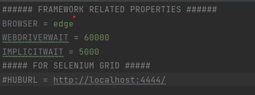
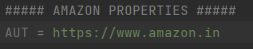

## Run tests by IDE

This is the most convenient way of running tests in hands-on-development, as you can right-click on any test files/testng and run them instantly.

### 1. To Modify Browser, Hub URL and Timeouts

- Use coreConfig.properties file in Path CoreProject/src/test/resources/coreConfig.properties

### 2. To Modify AUT and to set Properties related to Project

- Use amazon.properties file in Path AmazonProject/src/test/resources/amazon.properties

### Right-click on any Test or testng.xml File and perform Run

Notes: 
- User should run the test from testng File to get Extent Reports, Because the listeners are configured only in testng.xml 
- Extent Reports for Test Run can be viewed from path CoreProject/testReports/index.html
- To Execute Test locally comment out HUBURL in coreConfig.properties with #
- To Execute Test in Selenium Grid, specify HUB URL in coreConfig.properties

