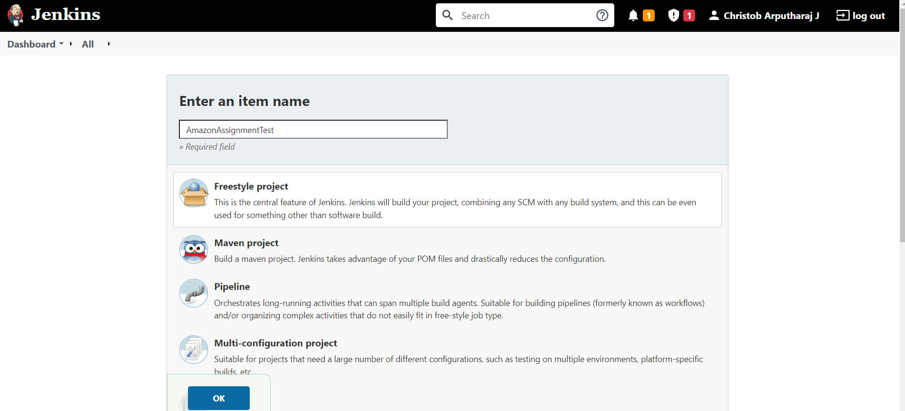
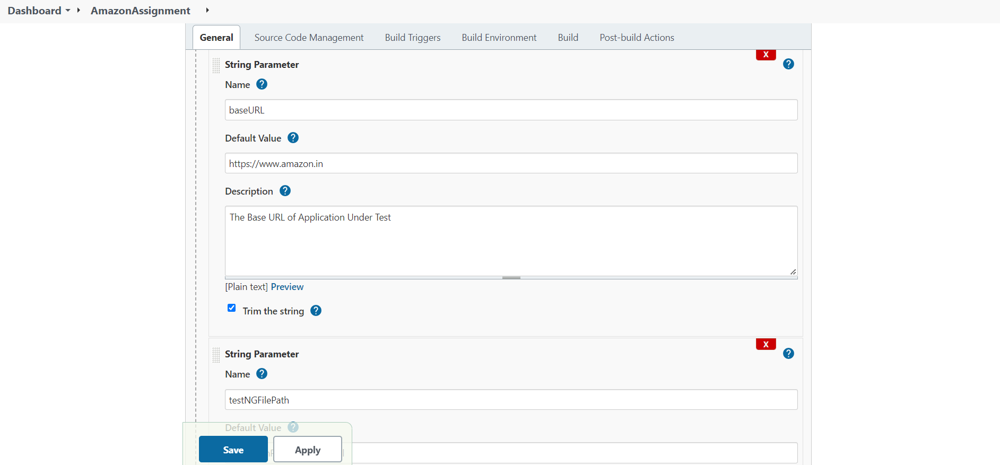
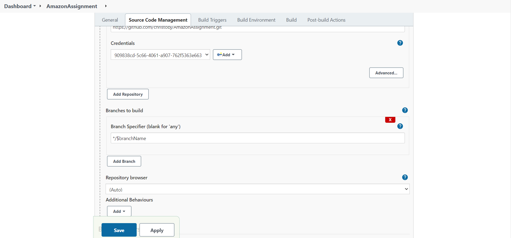
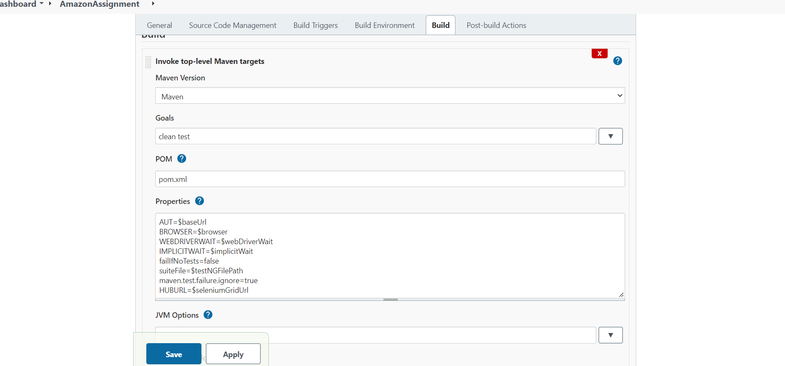
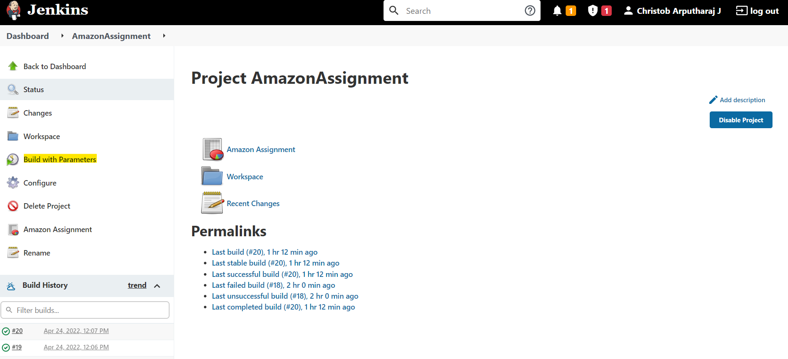
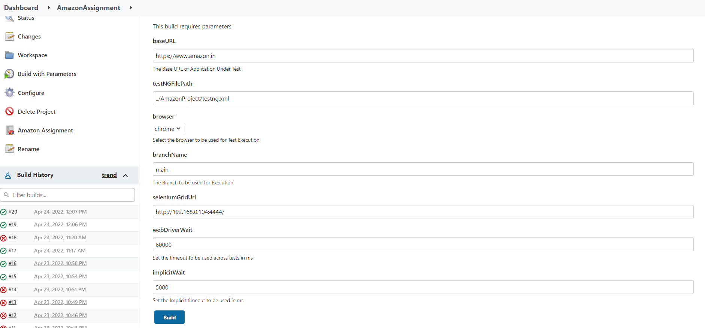
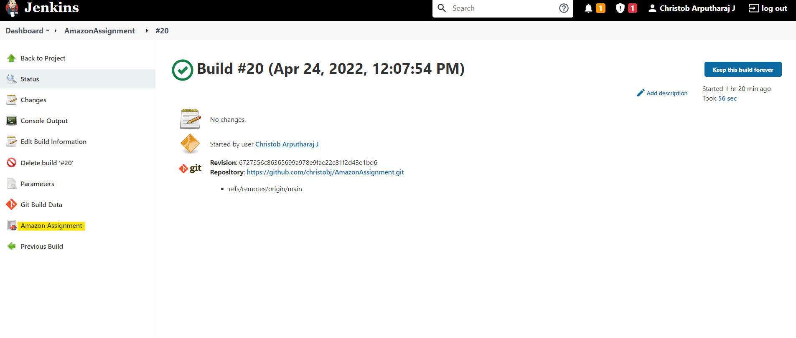
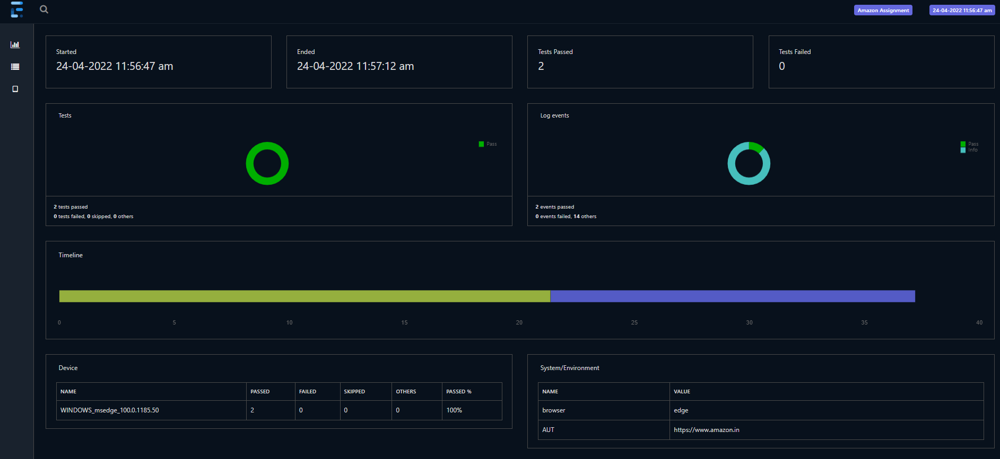
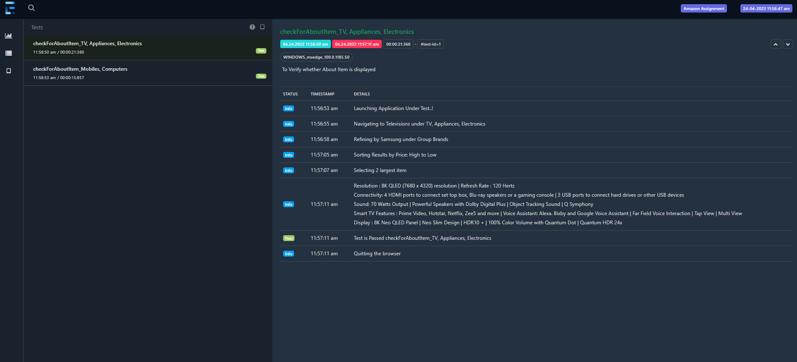

## Run tests by Jenkins

### 1. Create a Job in Jenkins

1. This Project can be integrated with Jenkins easily
2. Login to Jenkins
3. Create FreeStyle Project

4. Create Job Parameters to set all Properties, based on Test Need

5. Repeat the same step for all Parameters
6. Create Parameter with name as `branchName`, and use the same in Git(Branches to build)
7. This will allow to use any branch to pickup and execute Test

8. Configure goal and Options

### 2. Create a build with your parameters

 * If Selenium Grid execution is not needed, Please set seleniumGridUrl as empty.

### 3. Check Tests Execution Report(Extent Report) Link

1. Extent Report for Each Build can be seen, by opening the build

2. All Required Details can be viewed from Extent Report

3. On Failure Screenshots and Logs will be displayed in Report
